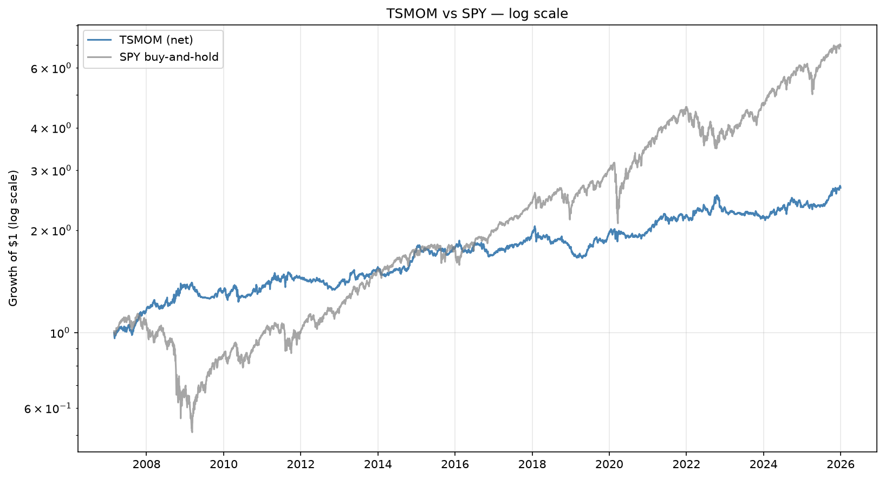
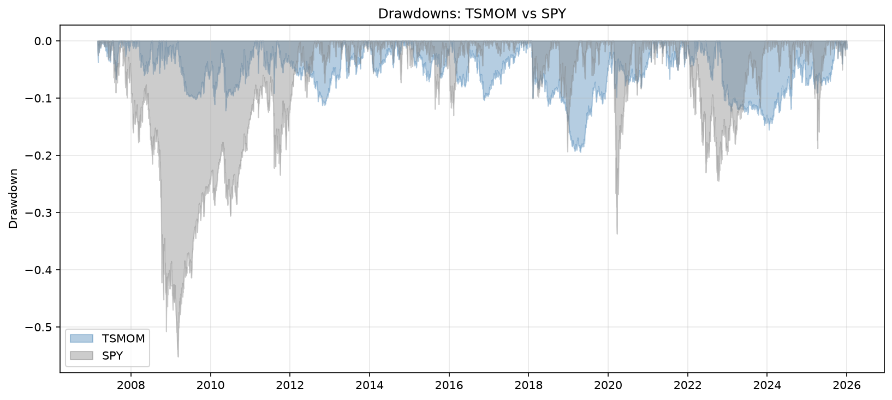
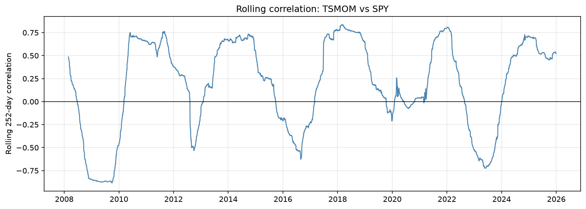

# Time-Series Momentum on a Diversified ETF Basket

A trend-following strategy that takes long or short positions in eight ETFs
across equities, fixed income, commodities, and real estate, based on the sign
of each asset's own past returns. The strategy implements the time-series
momentum framework of Moskowitz, Ooi, and Pedersen (2012) with volatility
targeting, monthly rebalancing, and transaction cost accounting.

**[Read the full analysis notebook](tsmom_exploration.ipynb)** — 36 cells
covering methodology, headline results, statistical tests, robustness checks,
and limitations.

## Headline results

Over 2007–2025, on eight ETFs:

| Metric | TSMOM | SPY buy-and-hold |
|---|---|---|
| CAGR | 5.34% | 10.85% |
| Annual vol | 9.65% | 19.81% |
| Sharpe | 0.59 | 0.62 |
| Max drawdown | -19.4% | -55.2% |
| Beta to SPY | 0.008 | 1.00 |
| Alpha (annualised) | 5.58% (t = 2.58) | — |

The strategy does not beat SPY in absolute return. Its value is as a
diversifier: a return stream with near-zero average beta (the rolling correlation
to SPY ranges from about -0.9 to +0.8, so it is not uncorrelated at every point
in time) and roughly one-third the drawdown. Adding a 20% allocation to a SPY
portfolio raises the combined Sharpe from 0.62 to 0.68 while cutting the max
drawdown from -55% to -43%. The 95% bootstrap CI on the Sharpe is [0.18, 1.00].

## Figures







## Method

1. **Signal.** At each month-end, compute the sign of each asset's trailing
   6-month and 12-month return. Average the two signs; the result ranges from
   -1 (both horizons down) to +1 (both horizons up).
2. **Sizing.** Target 20% annualised volatility per asset by scaling inversely
   to trailing 60-day realised volatility, capped at 2× leverage.
3. **Timing.** Decide at the month-end close, hold the position fixed until the
   next month-end. Returns are earned from the day after the decision.
4. **Costs.** 5 basis points per dollar traded.
5. **Portfolio.** Equal average across the eight assets, since each is already
   vol-targeted and therefore contributes roughly equal risk.

## Project structure

```
.
├── README.md
├── requirements.txt
├── tsmom_monthly.py        # strategy: data loading, backtest, perf stats
├── stats.py                # analysis: bootstrap, regression, plots
├── tsmom_exploration.ipynb  # narrative notebook with figures and interpretation
├── data/
│   └── prices.csv          # cached adjusted closes (gitignored, regenerated on first run)
└── figures/
    ├── equity_curve.png
    ├── drawdowns.png
    ├── rolling_sharpe.png
    └── rolling_corr.png
```

## Setup

```bash
python -m venv .venv
source .venv/bin/activate          # macOS / Linux
# .venv\Scripts\activate           # Windows
pip install -r requirements.txt
python tsmom_monthly.py
```

Prints a performance table (vol-targeted and equal-weight versions), SPY
buy-and-hold over the same period, and the strategy's beta to SPY, and shows a
cumulative-return plot. The notebook generates the figures saved in `figures/`.

To reproduce the full analysis, open the notebook:

```bash
jupyter notebook tsmom_exploration.ipynb
```

## Data

Daily adjusted closes from Yahoo Finance via `yfinance`, covering 2006-01-01
through 2026-01-01. The first valid trading day for the backtest is
2007-02-28, when all eight ETFs have sufficient history for a 12-month signal
and a 60-day vol estimate.

ETFs: `SPY, EFA, EEM, TLT, IEF, DBC, GLD, VNQ`.

The file `data/prices.csv` caches the download; delete it to force a fresh
fetch.

## Limitations

- No financing cost on leverage above 1× capital (average gross exposure is
  1.05×, so the effect is small).
- No borrow cost on short positions (would reduce Sharpe by roughly 0.02–0.03 at
  50 bps annualised).
- ETF basket selected with hindsight.
- Sharpe is arithmetic, mean/std × √252, on raw returns without subtracting
  cash.
- Conditional drawdown returns are regime averages, not calendar returns.

See the notebook's Limitations section for a complete discussion.

## Reference

Moskowitz, T., Ooi, Y. H., & Pedersen, L. H. (2012). Time Series Momentum.
*Journal of Financial Economics*, 104(2), 228–250.
